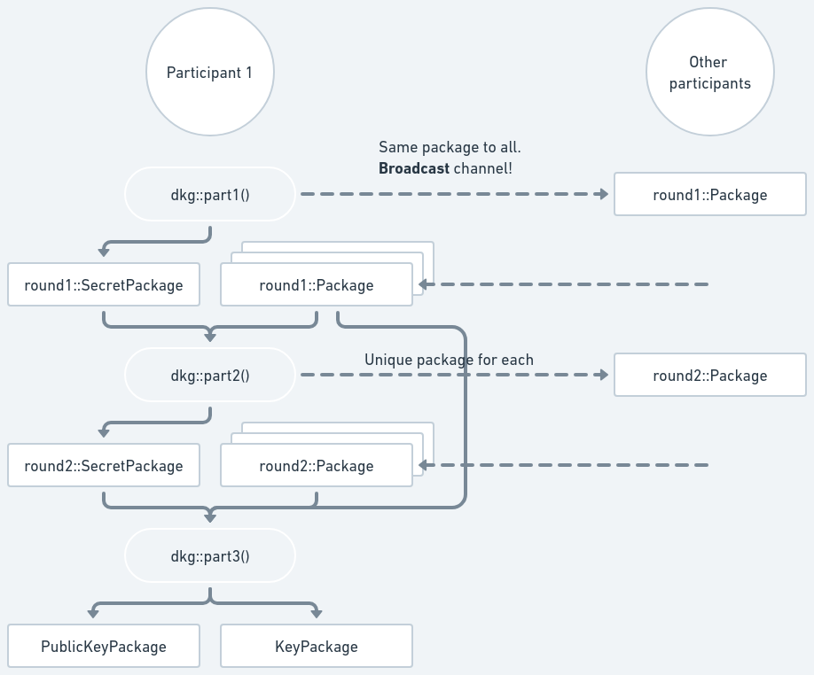

# Distributed Key Generation

The diagram below shows the distributed key generation process. Dashed lines
represent data being sent through an [authenticated and confidential
communication
channel](https://frost.zfnd.org/terminology.html#peer-to-peer-channel). Note
that the first dashed line requires a [**broadcast
channel**](https://frost.zfnd.org/terminology.html#broadcast-channel)



## Part 1

To start the DKG, each participant calls
[`dkg::part1()`](https://docs.rs/frost-ristretto255/latest/frost_ristretto255/keys/dkg/fn.part1.html)
passing its identifier, the desired threshold and total number of participants.
(Thus, they need to agree on those parameters via some mechanism which is up to
the application.) It returns a `round1::SecretPackage` and a `round1::Package`:

```rust,no_run,noplayground
{{#include ../../../frost-ristretto255/dkg.md:dkg_import}}

    // Ask the user which identifier they would like to use. You can create
    // an identifier from a non-zero u16 or derive from an arbitrary string.
    // Some fixed examples follow (each participant must choose a different identifier)
{{#include ../../../frost-ristretto255/tests/integration_tests.rs:dkg_identifier}}

{{#include ../../../frost-ristretto255/dkg.md:dkg_part1}}
```

```admonish info
Check the crate documentation for a [full working example](https://docs.rs/frost-ristretto255/latest/frost_ristretto255/keys/dkg/index.html#example); keep in mind it's an artificial
one since everything runs in the same program.
```

The `round1::SecretPackage` must be kept in memory to use in the next round. The
`round1::Package` must be sent to all other participants using a [**broadcast
channel**](https://frost.zfnd.org/terminology.html#broadcast-channel) to ensure
that all participants receive the same value.

```admonish danger
A [**broadcast
channel**](https://frost.zfnd.org/terminology.html#broadcast-channel) in this
context is not simply broadcasting the value to all participants. It requires
running a protocol to ensure that all participants have the same value or that
the protocol is aborted. Check the linked [Terminology
section](https://frost.zfnd.org/terminology.html#broadcast-channel) for more
details.

**Failure in using a proper broadcast channel will make the key generation
insecure.**
```

## Part 2

Upon receiving the other participants' `round1::Package`s, each participant then
calls
[`dkg::part2()`](https://docs.rs/frost-ristretto255/latest/frost_ristretto255/keys/dkg/fn.part2.html)
passing their own previously created `round1::SecretPackage` and a map of the
received `round1::Packages`, keyed by the Identifiers of the participant that
sent each one of them. (These identifiers must come from whatever mapping the
coordinator has between communication channels and participants, i.e. they must
have assurance that the `round1::Package` came from the participant with that
identifier.) It returns a `round2::SecretPackage` and a `BTreeMap` mapping other
participants's `Identifier`s to `round2::Package`s:

```rust,no_run,noplayground
{{#include ../../../frost-ristretto255/dkg.md:dkg_part2}}
```

The `round2::SecretPackage` must be kept in memory for the next part; the
`round1::SecretPackage` is consumed and is not required anymore.

The `round2::Package`s must be sent to their respective participants with the
given `Identifier`s, using an [authenticated and confidential communication
channel](https://frost.zfnd.org/terminology.html#peer-to-peer-channel).

## Part 3

Finally, upon receiving the other participant's `round2::Package`, the DKG is
concluded by calling
[`dkg::part3()`](https://docs.rs/frost-ristretto255/latest/frost_ristretto255/keys/dkg/fn.part3.html)
passing the same `round1::Package`s received in Part 2, the `round2::Package`s
just received (again keyed by the Identifier of the participant that sent each
one of them), and the previously stored `round2::SecretPackage` for the
participant. It returns a `KeyPackage`, with the participant's secret share, and
a `PublicKeyPackage` containing the group verifying key:

```rust,no_run,noplayground
{{#include ../../../frost-ristretto255/dkg.md:dkg_part3}}
```

```admonish note
All participants will generate the same `PublicKeyPackage`.
```