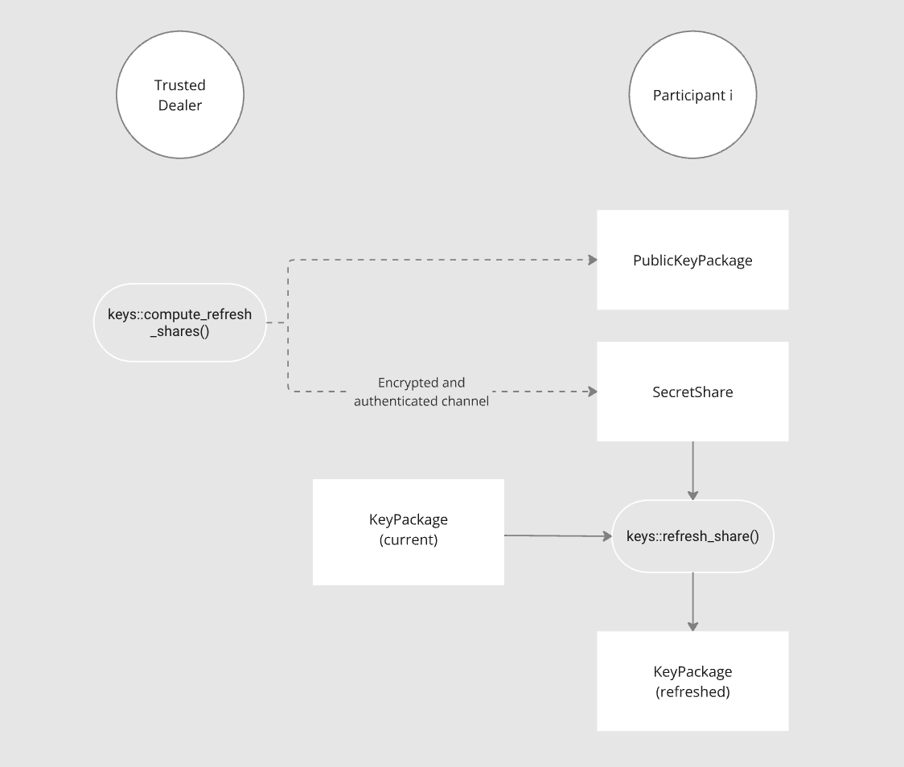

# Refreshing Shares using a Trusted Dealer

The diagram below shows the refresh share process. Dashed lines
represent data being sent through an [authenticated and confidential communication
channel](https://frost.zfnd.org/terminology.html#peer-to-peer-channel).

<!--  -->

The Trusted Dealer needs to first run `compute_refreshing_shares()` which
returns SecretShares (the "refreshing shares") and a PublicKeyPackage. Each
`SecretShare` must then be sent along with the `PublicKeyPackage` via an
[**authenticated** and **confidential** channel
](https://frost.zfnd.org/terminology.html#peer-to-peer-channel) for each
participant.

Each Participant then runs `refresh_share()` to generate a new `KeyPackage`
which will replace their old `KeyPackage`; they must also replace their old
`PublicKeyPackage` with the one sent by the Trusted Dealer.

```admonish danger
The refreshed `KeyPackage` contents must be stored securely and the original
`KeyPackage` should be deleted. For example:

- Make sure other users in the system can't read it;
- If possible, use the OS secure storage such that the package
  contents can only be opened with the user's password or biometrics.
```

```admonish danger
Applications should first ensure that all participants who refreshed their
`KeyPackages` were actually able to do so successfully, before deleting their old
`KeyPackages`. How this is done is up to the application; it might require
successfully generating a signature with all of those participants.
```

```admonish danger
Refreshing Shares may be not enough to address security concerns
after a share has been compromised. Refer to to the [Understanding
FROST](../frost.md#refreshing-shares) section.
```