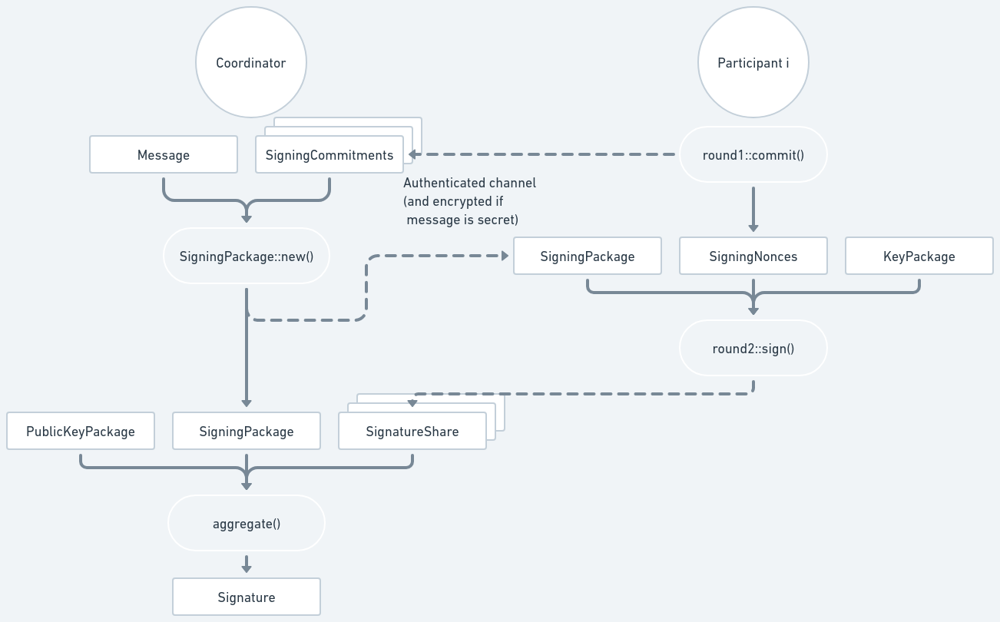

# Signing

The diagram below shows the signing process. Dashed lines represent data being
sent through an [authenticated communication
channel](https://frost.zfnd.org/terminology.html#peer-to-peer-channel).



## Coordinator, Round 1

To sign, the
[Coordinator](file:///home/conrado/zfnd/frost/book/book/frost.html#signing) must
select which participants are going to generate the signature, and must signal
to start the process. This needs to be implemented by users of the ZF FROST library and will depend on
the communication channel being used.

## Participants, Round 1

Each selected participant will then generate the nonces (a `SigningNonces`) and
their commitments (a `SigningCommitments`) by calling
[`round1::commit()`](https://docs.rs/frost-ristretto255/latest/frost_ristretto255/round1/fn.commit.html):

```rust,no_run,noplayground
{{#include ../../../frost-ristretto255/README.md:round1_commit}}
```

The `SigningNonces` must be kept by the participant to use in Round 2, while the
`SigningCommitments` must be sent to the Coordinator using an [authenticated
channel](https://frost.zfnd.org/terminology.html#peer-to-peer-channel).

## Coordinator, Round 2

The Coordinator will get all `SigningCommitments` from the participants and the
message to be signed, and then build a `SigningPackage` by calling
[`SigningPackage::new()`](https://docs.rs/frost-core/latest/frost_core/frost/struct.SigningPackage.html#method.new).

```rust,no_run,noplayground
{{#include ../../../frost-ristretto255/README.md:round2_package}}
```

The `SigningPackage` must then be sent to all the participants using an
[authenticated
channel](https://frost.zfnd.org/terminology.html#peer-to-peer-channel). (Of course,
if the message is confidential, then the channel must also be confidential.)

```admonish warning
In all of the main FROST ciphersuites, the entire message must
be sent to participants. In some cases, where the message is too big, it may be
necessary to send a hash of the message instead. We strongly suggest creating a
specific ciphersuite for this, and not just sending the hash as if it were the
message. For reference, see [how RFC 8032 handles
"pre-hashing"](https://datatracker.ietf.org/doc/html/rfc8032).
```

## Participants, Round 2

Upon receiving the `SigningPackage`, each participant will then produce their
signature share using their `KeyPackage` from the key generation process and
their `SigningNonces` from Round 1, by calling
[`round2::sign()`](https://docs.rs/frost-ristretto255/latest/frost_ristretto255/round2/fn.sign.html):

```rust,no_run,noplayground
{{#include ../../../frost-ristretto255/README.md:round2_sign}}
```

The resulting `SignatureShare` must then be sent back to the Coordinator using
an [authenticated
channel](https://frost.zfnd.org/terminology.html#peer-to-peer-channel).

```admonish important
In most applications, it is important that the participant must be aware of what
they are signing. Thus the application should show the message to the
participant and obtain their consent to proceed before producing the signature
share.
```

## Coordinator, Aggregate

Upon receiving the `SignatureShare`s from the participants, the Coordinator can
finally produce the final signature by calling
[`aggregate()`](https://docs.rs/frost-ristretto255/latest/frost_ristretto255/fn.aggregate.html)
with the same `SigningPackage` sent to the participants and the
`PublicKeyPackage` from the key generation (which is used to validate each
`SignatureShare`).

```rust,no_run,noplayground
{{#include ../../../frost-ristretto255/README.md:aggregate}}
```

The returned signature, a `Signature`, will be a valid signature for the message
in the `SigningPackage` in Round 2 for the group verifying key in the `PublicKeyPackage`.

```admonish note
FROST supports identifiable abort: if a participant misbehaves and produces an
invalid signature share, then aggregation will fail and the returned error
will have the identifier of the misbehaving participant. (If multiple participants
misbehave, only the first one detected will be returned.)

What should be done in that case is up to the application. The misbehaving participant
could be excluded from future signing sessions, for example.
```


## Verifying signatures

The Coordinator could verify the signature with:

```rust,no_run,noplayground
{{#include ../../../frost-ristretto255/README.md:verify}}
```

(There is no need for the Coordinator to verify the signature since that already
happens inside `aggregate()`. This just shows how the signature can be
verified.)
