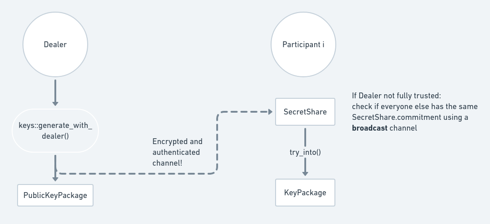

# Trusted Dealer Key Generation

The diagram below shows the trusted dealer key generation process. Dashed lines
represent data being sent through an [authenticated and confidential communication
channel](https://frost.zfnd.org/terminology.html#peer-to-peer-channel).



To generate the key shares, the dealer calls
[`generate_with_dealer()`](https://docs.rs/frost-ristretto255/latest/frost_ristretto255/keys/fn.generate_with_dealer.html).
It returns a `BTreeMap` mapping the (automatically generated) `Identifier`s to
their respective `SecretShare`s, and a `PublicKeyPackage` which contains the
`VerifyingShare` for each participant and the group public key (`VerifyingKey`).

```rust,no_run,noplayground
{{#include ../../../frost-ristretto255/README.md:tkg_gen}}
```

Each `SecretShare` must then be sent via an [**authenticated** and
**confidential** channel
](https://frost.zfnd.org/terminology.html#peer-to-peer-channel) for each
participant, who must verify the package to obtain a `KeyPackage` which contains
their signing share, verifying share and group verifying key. This is done with
[`KeyPackage::try_from()`](https://docs.rs/frost-core/latest/frost_core/frost/keys/struct.KeyPackage.html#method.try_from):

```rust,no_run,noplayground
{{#include ../../../frost-ristretto255/README.md:tkg_verify}}
```

```admonish info
Check the crate documentation for a [full working example](https://docs.rs/frost-ristretto255/latest/frost_ristretto255/index.html#example-key-generation-with-trusted-dealer-and-frost-signing); keep in mind it's an artificial
one since everything runs in the same program.
```

```admonish info
You can specify which identifiers to use by using [`IdentifierList::Custom`](https://docs.rs/frost-core/latest/frost_core/frost/keys/enum.IdentifierList.html#variant.Custom). Refer to the [DKG](dkg.md#part-1) section for an example on how to create identifiers.
```

```admonish danger
Which [**authenticated** and **confidential** channel](https://frost.zfnd.org/terminology.html#peer-to-peer-channel)
to use is up to the application. Some examples:

- Manually require the dealer to sent the `SecretShare`s to the
  partipants using some secure messenger such as Signal;
- Use a TLS connection, authenticating the server with a certificate
  and the client with some user/password or another suitable authentication
  mechanism;

Refer to the [Terminology page](https://frost.zfnd.org/terminology.html#peer-to-peer-channel)
for more details.

Failure of using a **confidential** channel may lead to the shares being
stolen and possibly allowing signature forgeries if a threshold number of
them are stolen.

Failure of using an **authenticated** channel may lead to shares being
sent to the wrong person, possibly allowing unintended parties
to generate signatures.
```

```admonish danger
The `KeyPackage` contents must be stored securely. For example:

- Make sure other users in the system can't read it;
- If possible, use the OS secure storage such that the package
  contents can only be opened with the user's password or biometrics.
```

```admonish warning
The participants may wish to not fully trust the dealer. While **the dealer
has access to the original secret and can forge signatures
by simply using the secret to sign** (and this can't be
possibly avoided with this method; use Distributed Key Generation
if that's an issue), the dealer could also tamper with the `SecretShare`s
in a way that the participants will never be able to generate a valid
signature in the future (denial of service). Participants can detect
such tampering by comparing the `VerifiableSecretSharingCommitment`
values from their `SecretShare`s (either by some manual process, or
by using a [broadcast channel](https://frost.zfnd.org/terminology.html#broadcast-channel))
to make sure they are all equal.
```
