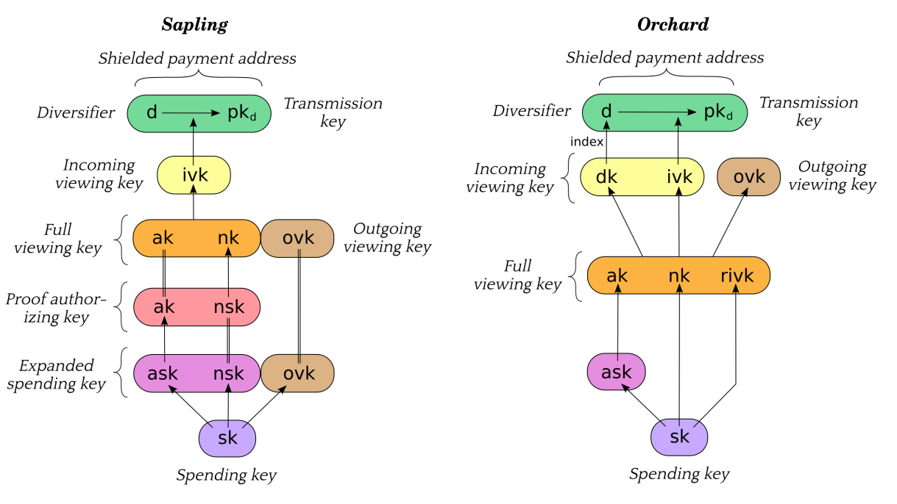

# Technical Details

FROST only works with Schnorr signatures. Zcash transaprent transactions use
ECDSA, therefore FROST does not work with Zcash transaparent addresses. (This
could change if the Taproot upgrade from Bitcoin is ported to Zcash, but it
seems unlikely.)

Zcash supports three shielded pools: Sprout, Sapling and Orchard. Sprout
is being deprecated so we only need to care about Sapling and Orchard.

Sapling and Orchard keys are commonly derived from a single spending key (which
in turn is commonly derived from a seed phrase). This is shown in the figure
below, taken from the [Zcash
protocol](https://zips.z.cash/protocol/protocol.pdf#addressesandkeys):




To use FROST with Zcash, the key that needs to be split is the **Spend
Authorizing Key** or `ask`. This is the key that signs transactions and allow
they to go through.

## Key Derivation and DKG Support

As shown in the figure, the `ask` is commonly derived from the **Spending Key**
`sk`. At first, this could indicate that it is impossible to use Distributed Key
Generation (DKG) in this scenario, since the key it creates is unpredictable.

However, the protocol does not *require* `ask` to be derived from `sk`.
This would allow creating key shares using DKG, which will also output
`ak` (which is simply the public key matching `ask`). Thus:

- With Sapling, the rest of the keys can be derived from that `ak` and either:
  - An `sk` which is used to derive only `nsk` and `ovk`;
  - Or generating `nsk` and `ovk` by themselves (or generating them from a
    random `sk` which is thrown away).
- With Orchard, the rest of the keys can be derived from that `ak` and either:
  - An `sk` which is used to derive only `nk` and `rivk`;
  - Or generating `nk` and `rivk` by themselves (or generating them from a
    random `sk` which is thrown away).

Arguably this should be done even if Trusted Dealer Key Generation is used: the
goal of FROST is requiring multiple entities to authorize a transaction, not
having a seed phrase that allows recreating the `ask` ensures that property.

## Backing Up Key Shares

Zcash users are familiar with the concept of seed phrases and with how they
can always recover their wallet with it.

However, FROST wallets need more information to be restored:

- FROST-related:
  - Key share
  - Verifying shares of all participants
  - Public keys and identifiers of all participants if online communication is
    being used
- Zcash-related:
  - Sapling: `sk`, or both Proof authorizing key (`ak` and `nsk`) and Outgoing
    viewing key (`ovk`)
  - Orchard: `sk`, or Full viewing key (`ak`, `nk`, `rivk`). The upside of using
    the Full viewing key is that there is already a format for encoding it.

Thus, even if a `sk` derived from a seed phrase is used, that is not enough to
restore a FROST wallet. In fact it would be probably confusing to use a seed
phrase since users wouldn't be able to tell if it's a regular Zcash seed phrase
or a FROST seed phrase which needs additional information to be restored.

For this reason it seems impossible to easily encode a FROST wallet, so using
something like a JSON file with all this information is advisable.

Of course, unlike regular Zcash wallets, a user losing their FROST wallet is
not catastrophical. Users can recover their key share with the help of other
participants, and would only need to remember their identifier (and other
participants can probably help with that).

```admonish note
Orchard is simpler to handle, so it may be a good idea to just
support it with FROST.
```

```admonish note
The only secret information is the key share. So another possibility
is to just ask the user to backup it (using a seed phrase format, or other
string encoding) and get the remaining information from the other participants
when recovering a wallet.
```

## Communications

The biggest challenge in using FROST with Zcash is allowing participants to
communicate securely with each other, which is required to run the FROST
protocol. Since wallets don't currently need to communication to each other, a
whole new mechanism will need to be implemented.

For this to happen, two things are required:

- Allowing wallets to actually communicate with each other (regardless of
  security). This is challenging because users are usually behind NATs and
  firewalls, so they can't simply open TCP connections with each other. So
  some kind of signaling server may be needed.
- Making the communication secure. This is actually fairly solvable while not
  trivial and we're planning on working on a library to address it. It needs to
  provide authentication and confidentiality, for example using the Noise
  protocol. Also needs to provide a [broadcast
  channel](https://frost.zfnd.org/terminology.html#broadcast-channel) on top of
  it.
- Managing public keys. Another challenging part. Users need to be able to
  create a key pair of keys used for the secure communication, and exporting
  public keys to each other. This is similar to contact management that some
  wallets have, so a possibility is to expand on that (instead of storing
  just name and address, also store identifier and public key).

```info
One long-term idea is to extend the Zcash protocol to allow P2P messaging.
This has been discussed in the context of sending encrypted notes via the network
instead of publishing them on the blockchain.
```

```info
Another idea is to extend lightwalletd servers to support messaging, since
wallets are all already connected to a server (not the same one, so inter-server
communications would be also needed)
```