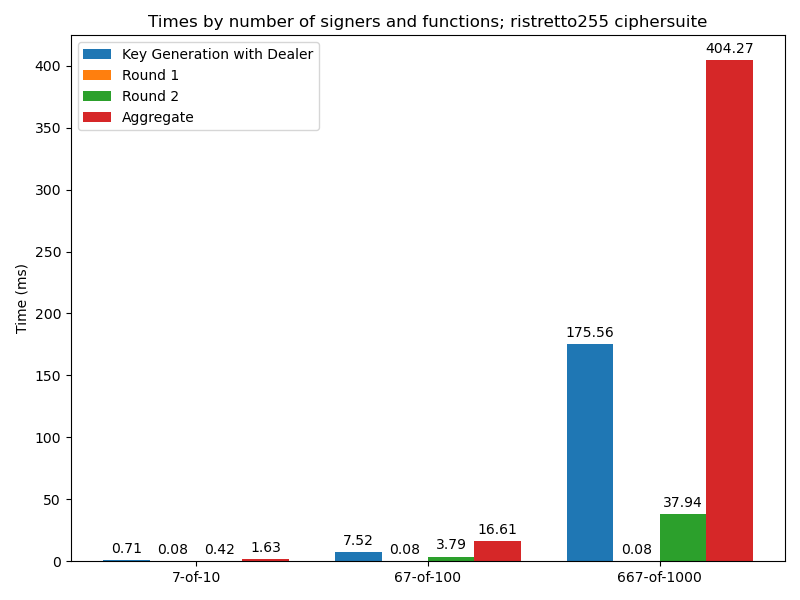
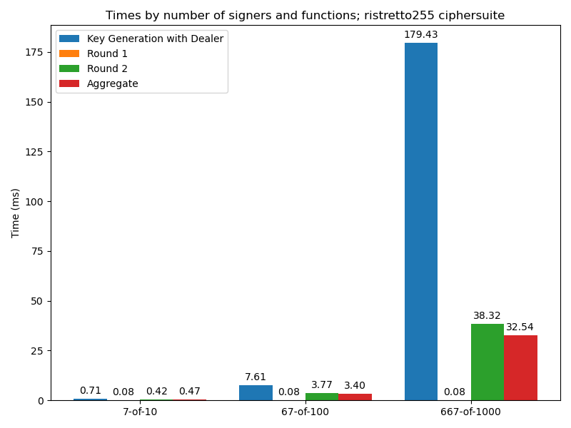
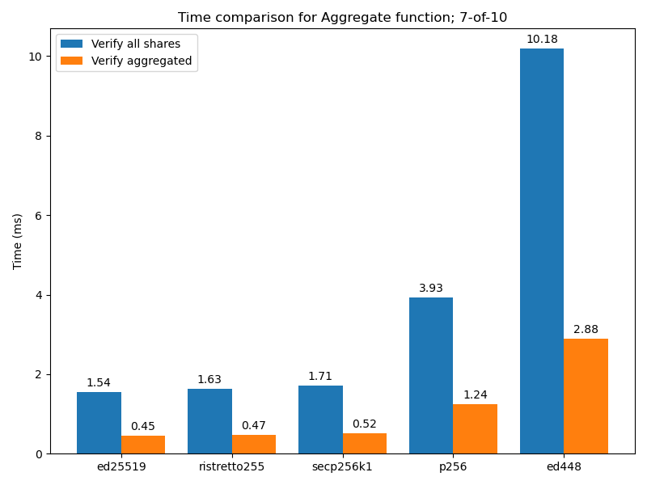
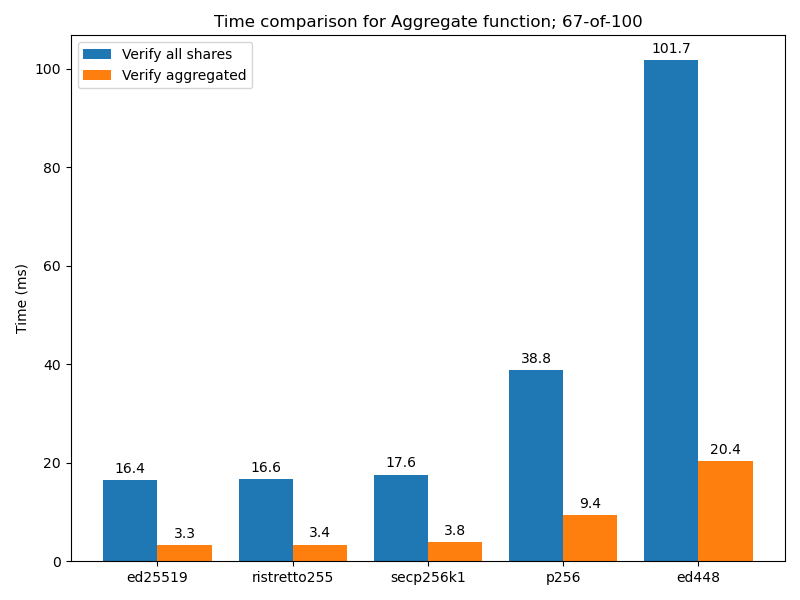
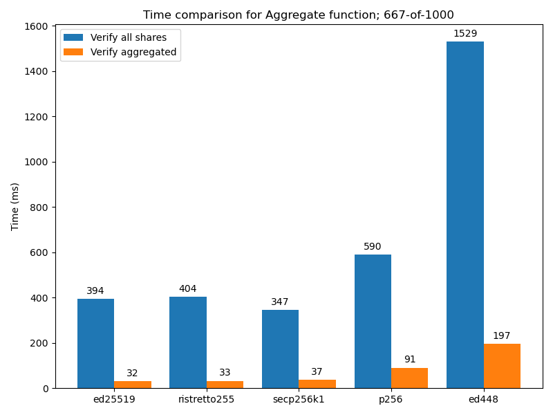
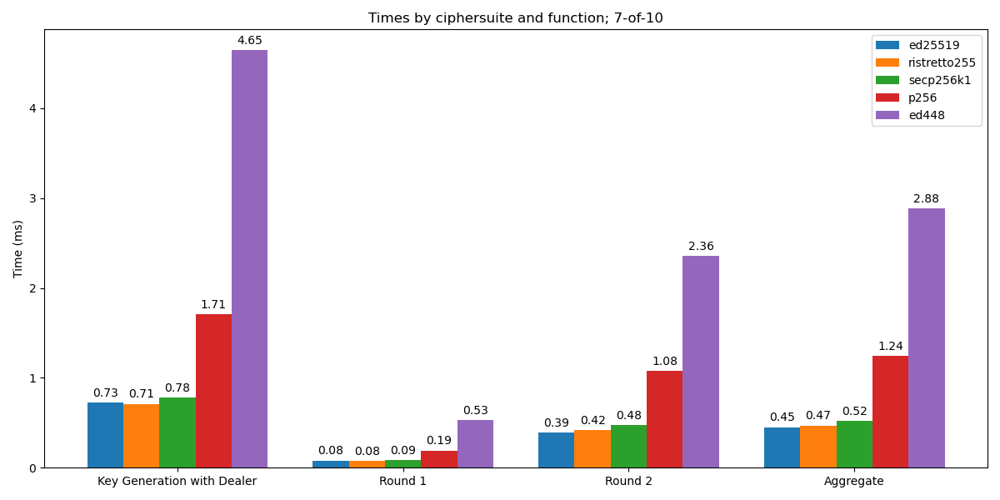
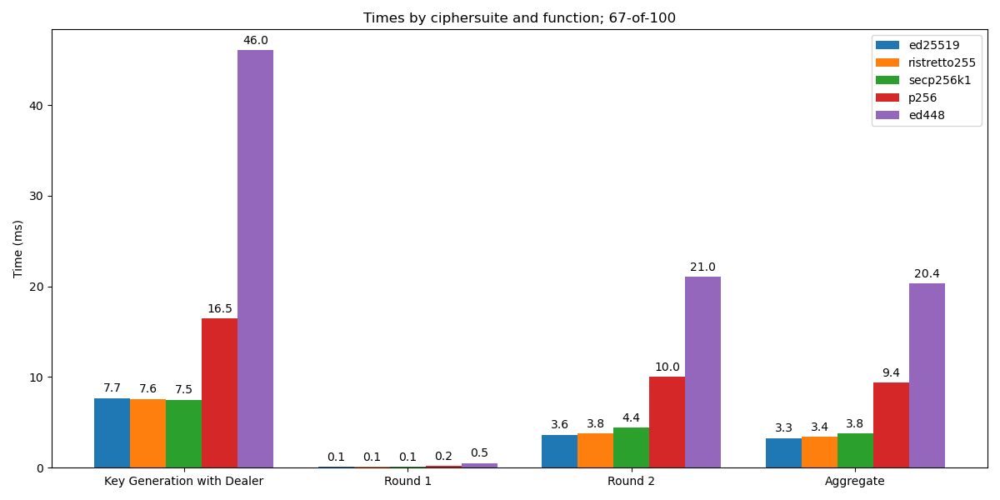
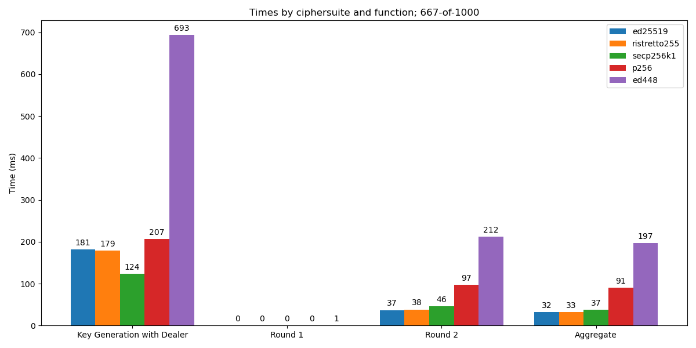

# FROST Performance

## What is FROST?

FROST is a threshold Schnorr signature scheme
[invented](https://eprint.iacr.org/2020/852) by Chelsea Komlo (researcher at the
Zcash Foundation) and Ian Goldberg, and in the process of becoming an [IETF
RFC](https://datatracker.ietf.org/doc/draft-irtf-cfrg-frost/). Threshold
signatures allow a private key being split into shares given to multiple
participants, allowing a subgroup of them (e.g. 3 out of 5, or whatever
threshold specified at key generation) to generate a signature that can be
verified by the group public key, as if it were signed by the original unsplit
private key. It has many applications such as allowing multiple entities to
manage a cryptocurrency wallet in a safer and more resilient manner.

Currently, the RFC is close to completion, and we also completed [a Rust
implementation](https://github.com/ZcashFoundation/frost/) of all ciphersuites
specified in the RFC, and are now doing final cleanups and improvements prior to
the first release of the crates (which will soon be audited).

## Benchmarking and investigating the Aggregate step

When we presented FROST at Zcon 3, we were asked how FROST performed in larger
settings, such as a 667-of-1000 signers. (This is motivated by a mechanism
proposed by Christopher Goes for [bridging Zcash with other ecosystems using
FROST](https://forum.zcashcommunity.com/t/proposed-architecture-for-a-zcash-namada-ibc-ecosystem-ethereum-ecosystem-non-custodial-bridge-using-frost-multisignatures/42749).)
We set out to benchmark our Rust implementation, and were a bit surprised about
one particular step: “Aggregate”.

The FROST scheme can be split into steps. The first one is Key Generation, which
only needs to be done once, while the rest are carried out each time the group
wishes to generate a new signature. In Round 1, the participant generates
commitments which are broadcast to all other participants via a Coordinator. In
Round 2, using these commitments and their respective key shares generated
during Key Generation, they produce a signature share which is sent to the
Coordinator. Finally, the Coordinator carries out the final step, Aggregate,
which produces the final signatures from all the signatures shares received.

The benchmark for the Ristretto255 suite looked like the following. (Benchmarks
were run on an AMD Ryzen 9 5900X 3.7GHZ, Ubuntu 22.04, Rust 1.66.0.)

(Note that Round 1 and 2 timings in this post refer to per-signer timings, while
Key Generation and Aggregate are performed by the Coordinator.)

It was expected that the timings would increase with the larger number of
participants (with the exception of Round 1, which does not depend on that
number), but the Aggregate timings appeared too high, surpassing 400ms for the
667-of-1000 case (which may not seem much but it’s unusual for a signing
procedure).

We intended to investigate this but it was not necessary. Coincidentally, while
the RFC was in the last call for feedback, Tim Ruffing [pointed
out](https://mailarchive.ietf.org/arch/msg/cfrg/QQhyjvvcoaqLslaX3gWwABqHN-s/)
that Aggregate can be sped up significantly. Originally, it was specified that
each share received from the participants should be verified (each signature
share can be verified separately to ensure it is correct) and then aggregated.
Tim’s observation is that the shares can be simply aggregated and the final
signature verified with the group public key. If the verification fails, then
it’s possible to find which participant generated an incorrect share by
verifying them one by one (if desired). This greatly speeds up the case where
all shares are correct, which should be the most common.

This is how the Ristretto255 timings look like with that optimization
implemented:

Now the Aggregate performance is very similar to the Round 2 step, which makes
sense since they have a very similar structure.

Here’s the Aggregate performance comparison for all ciphersuites, in three
different scenarios:

## Examining overall performance

With the benchmark machinery in place (we used
[criterion.rs](https://github.com/bheisler/criterion.rs)) we can provide
benchmark results for all supported ciphersuites in different scenarios. These
all use the optimization described above.

The same data in table format:

<!-- Benchmarks -->
### ed448

|             | Key Generation with Dealer | Round 1 | Round 2 | Aggregate |
| :---------- | -------------------------: | ------: | ------: | --------: |
| 2-of-3      |                       1.56 |    0.51 |    0.75 |      1.39 |
| 7-of-10     |                       4.65 |    0.53 |    2.36 |      2.88 |
| 67-of-100   |                      46.05 |    0.52 |   21.04 |     20.37 |
| 667-of-1000 |                     693.45 |    0.53 |  211.68 |    197.00 |

### ristretto255

|             | Key Generation with Dealer | Round 1 | Round 2 | Aggregate |
| :---------- | -------------------------: | ------: | ------: | --------: |
| 2-of-3      |                       0.24 |    0.08 |    0.13 |      0.22 |
| 7-of-10     |                       0.71 |    0.08 |    0.42 |      0.47 |
| 67-of-100   |                       7.61 |    0.08 |    3.77 |      3.40 |
| 667-of-1000 |                     179.43 |    0.08 |   38.32 |     32.54 |

### p256

|             | Key Generation with Dealer | Round 1 | Round 2 | Aggregate |
| :---------- | -------------------------: | ------: | ------: | --------: |
| 2-of-3      |                       0.56 |    0.18 |    0.33 |      0.58 |
| 7-of-10     |                       1.71 |    0.19 |    1.08 |      1.24 |
| 67-of-100   |                      16.51 |    0.18 |   10.03 |      9.38 |
| 667-of-1000 |                     206.85 |    0.19 |   97.49 |     90.82 |

### secp256k1

|             | Key Generation with Dealer | Round 1 | Round 2 | Aggregate |
| :---------- | -------------------------: | ------: | ------: | --------: |
| 2-of-3      |                       0.26 |    0.09 |    0.15 |      0.25 |
| 7-of-10     |                       0.78 |    0.09 |    0.48 |      0.52 |
| 67-of-100   |                       7.50 |    0.09 |    4.41 |      3.82 |
| 667-of-1000 |                     123.74 |    0.09 |   46.11 |     37.48 |

### ed25519

|             | Key Generation with Dealer | Round 1 | Round 2 | Aggregate |
| :---------- | -------------------------: | ------: | ------: | --------: |
| 2-of-3      |                       0.24 |    0.08 |    0.12 |      0.22 |
| 7-of-10     |                       0.73 |    0.08 |    0.39 |      0.45 |
| 67-of-100   |                       7.70 |    0.08 |    3.64 |      3.28 |
| 667-of-1000 |                     181.45 |    0.08 |   36.92 |     31.88 |

<!-- Benchmarks -->

The time-consuming part of each step is elliptic curve point multiplication.
Here’s a breakdown:

- Key Generation with Trusted Dealer:

  - One base point multiplication to derive the group public key from the group
    private key;
  - One base point multiplication per MIN_PARTICIPANTS to derive a commitment
    for each polynomial coefficient;
  - One base point multiplication per MAX_PARTICIPANTS to derive their
    individual public keys.

- Round 1:

  - Two base point multiplications to generate commitments to the pair of
    nonces.

- Round 2:

  - One point multiplication per NUM_PARTICIPANTS to compute the group
    commitment.

- Aggregate:

  - One point multiplication per NUM_PARTICIPANTS to compute the group
    commitment. If the Coordinator is also a participant, they could reuse the
    value from Round 2, but we didn’t assume that in our benchmark (and our
    implementation does not support this for now);
  - One base point multiplication and one general point multiplication to verify
    the aggregated signature;
  - Verifying all shares (i.e. in our original approach, or to find a corrupt
    signer if the aggregated signature failed) additionally requires one base
    point multiplication and two general point multiplications per
    NUM_PARTICIPANTS to actually verify the share.
